### 🏥 Smart Hospital Network Infrastructure with Centralized Services Using Cisco Packet Tracer

---

**Institution:** East West University  
**Department:** Computer Science and Engineering (CSE)  
**Semester:** Summer 2025 — B.Sc. in CSE  
**Course:** CSE405 — Computer Networks | Section: 6  
**Submission Date:** 1st September, 2025  
**Course Teacher:** Rabea Khatun

| Name | Student ID |
|------|------------|
| Ahsiul Karim | 2022-3-60-074 |
| Sourav Roy | 2020-3-60-028 |
| Nasrullah Kaisher Sijan | 2023-1-60-204 |

---

## 📋 Table of Contents

1. [Introduction](#1-introduction)
2. [Design / Development / Implementation](#2-designdevelopmentimplementation)
   - [Project Details & Topology](#21-project-details)
   - [IP Configuration](#221-ip-configuration)
   - [FTP Server Setup](#222-ftp-server-setup)
   - [Email & DNS Server Configuration](#223-email--dns-server-configuration)
   - [Routing Configuration](#224-routing-configuration)
3. [Results & Discussion](#3-results-and-discussion)
   - [Network Connectivity](#31-network-connectivity)
   - [FTP Access Testing](#32-ftp-access-testing)
   - [Email Communication](#33-email-communication)
4. [Conclusion](#4-conclusion)

---

## 1. Introduction

### 1.1 Overview

This project designs a **secure, scalable smart hospital network** using Cisco Packet Tracer. It connects departments and administration under centralized services, including FTP with role-based access and email communication.

### 1.2 Motivation

The project aims to simulate a real-world hospital network that enhances efficiency, security, and interdepartmental communication while supporting centralized digital services.

### 1.3 Objectives

- Design and implement a **secure, scalable hospital-wide network infrastructure** for a smart healthcare system using Cisco Packet Tracer.
- Support **patient record management**, **real-time medical device monitoring**, and **efficient departmental communication**.
- Ensure **prioritized delivery** of critical services across all departments.

---

## 2. Design/Development/Implementation

### 2.1 Project Details

The network is structured as a **hierarchical campus network**, where individual departments function as independent LANs connected via core routers. Each LAN contains user PCs and a local switch, while interdepartmental connectivity is handled through interconnected routers using serial links. The **Administration section** serves as a centralized service hub.

**Topology Diagram (from Report):**

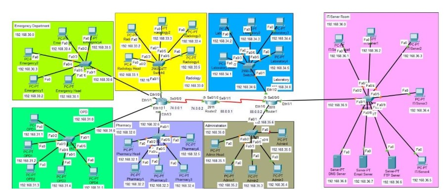

*Figure: Departmental Network Topology showing all departments — Emergency, OPD, Pharmacy, Radiology, Laboratory, Administration, and IT/Server Room — interconnected via 2811 Routers*

---

#### Topology Layers and Components

**Core Routers (Router Layer):**
- Five **2811 Routers** interconnect all departmental LANs using serial interfaces.
- Routers form a **mesh-like connection** for robust inter-subnet communication.
- **Serial links** are used for router-to-router connectivity.

**Departmental LAN Subnets:**

| Department | Subnet | Gateway | Assigned IPs |
|---|---|---|---|
| Emergency Department | 192.168.30.0/24 | 192.168.30.6 | 192.168.30.1 – 192.168.30.4 |
| Outpatient Department (OPD) | 192.168.31.0/24 | 192.168.31.6 | 192.168.31.1 – 192.168.31.4 |
| Pharmacy Department | 192.168.32.0/24 | 192.168.32.6 | 192.168.32.1 – 192.168.32.5 |
| Radiology Department | 192.168.33.0/24 | 192.168.33.6 | 192.168.33.1 – 192.168.33.5 |
| Laboratory Department | 192.168.34.0/24 | 192.168.34.6 | 192.168.34.1 – 192.168.34.5 |
| Administration Section | 192.168.35.0/24 | 192.168.35.6 | 192.168.35.1 – 192.168.35.5 |
| IT / Server Room | 192.168.36.0/24 | 192.168.36.9 | 192.168.36.1 – 192.168.36.9 |

---

### 2.2 Implementation

#### 2.2.1 IP Configuration

**For Routers — CLI Commands:**

```
Router> enable
Router# configure terminal
Router(config)# interface [Interface_Type]
Router(config-if)# ip address [IP_Address] [Subnet_Mask]
Router(config-if)# no shutdown
Router(config-if)# exit

``` 

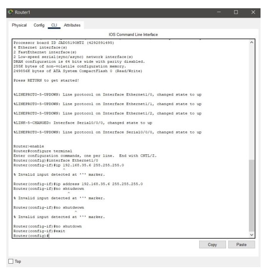

*Figure: IP assignment on Router1 via IOS CLI — assigning IP address `192.168.35.6` with subnet mask `255.255.255.0` on interface `Ethernet1/0`, followed by `no shutdown`. Interface Serial0/0/0 also comes up as confirmed by the LINEPROTO messages.*

---

**For PCs & Servers — Desktop IP Configuration:**

- Click **PC or Server → Desktop → IP Configuration**
- Set **IP Configuration** to `Static`
- Assign **IPv4 Address**, **Subnet Mask**, **Default Gateway**, and **DNS Server** per the IP Addressing Table.

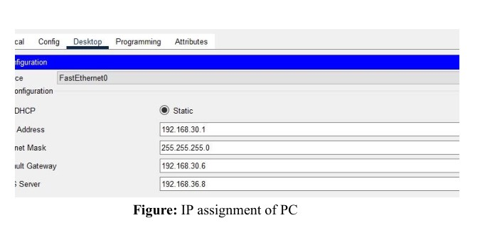

*Figure: Static IP configuration on an Emergency Department PC — IPv4 Address: `192.168.30.1`, Subnet Mask: `255.255.255.0`, Default Gateway: `192.168.30.6`, DNS Server: `192.168.36.8`.*

---
4
#### 2.2.2 FTP Server Setup

The FTP server at `192.168.36.6` was configured with **role-based access control (RBAC)**:

| Role | Permissions |
|---|---|
| AdminHead | Read, Write, Delete, Rename, List — Full Access (RWDNL) |
| Admin1 – Admin4 | Read only (R) |
| Department users (Emergency1–4, etc.) | Read only (R) |

**Screenshot 1 — FTP Server: AdminHead Full Access & Admin Read-Only Users**

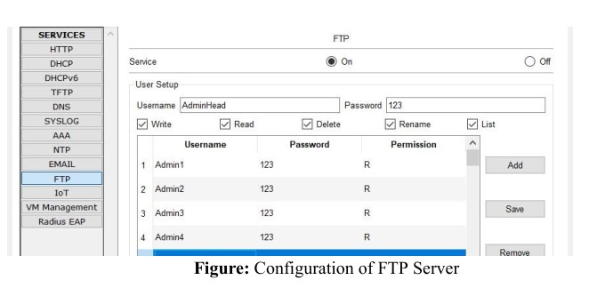

*Figure: FTP Server (Services → FTP) — Service is `ON`. `AdminHead` is selected in the User Setup with all permission checkboxes ticked: Write ✓, Read ✓, Delete ✓, Rename ✓, List ✓ (displayed as `RWDNL` in the table). Admin1, Admin2, Admin3, and Admin4 each have only `R` (Read-only) permission.*

---

**Screenshot 2 — FTP Server: Emergency1 Department User (Read-Only)**

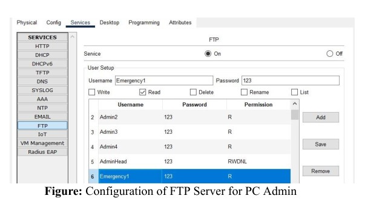

*Figure: FTP Server — `Emergency1` is selected in User Setup with only `Read` checkbox ticked (Write, Delete, Rename, List are all unchecked). The user table shows Admin2–Admin4 with `R`, AdminHead with `RWDNL`, and Emergency1 highlighted with `R`, confirming department users are restricted to Read-only access.*

---

**Screenshot 3 — FTP Server: Emergency4 and Further Emergency Users**

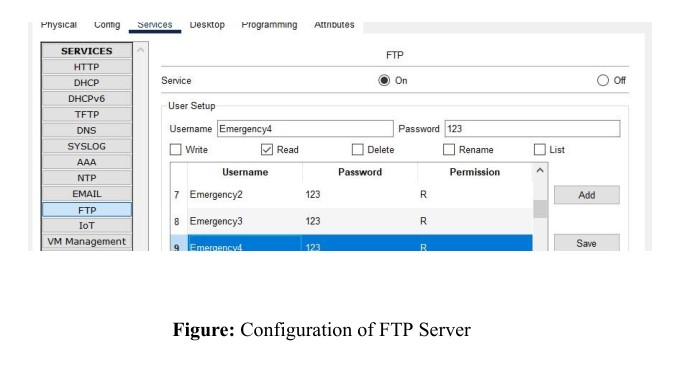

*Figure: FTP Server — `Emergency4` is selected in User Setup with only `Read` permission. The visible user list shows `Emergency2` (R), `Emergency3` (R), and `Emergency4` (R, highlighted), confirming all Emergency Department users have identical Read-only access restrictions.*

---

#### 2.2.3 Email & DNS Server Configuration

**Email Server Setup (SERVER → Services → EMAIL):**
- Enable **SMTP Service**: ON
- Enable **POP3 Service**: ON
- Set **Domain Name**: `gmail.com`
- Add all hospital users in the User Setup panel.

**PC Email Client Setup (PC → Desktop → Email):**
- Click PC → **Desktop tab → Email (Configure Mail)**
- Fill in: Name, Email Address, Incoming Mail Server, Outgoing Mail Server, Username, Password → click **Save**

**Screenshot 1 — Email Server: SMTP/POP3 Enabled with Full User List**

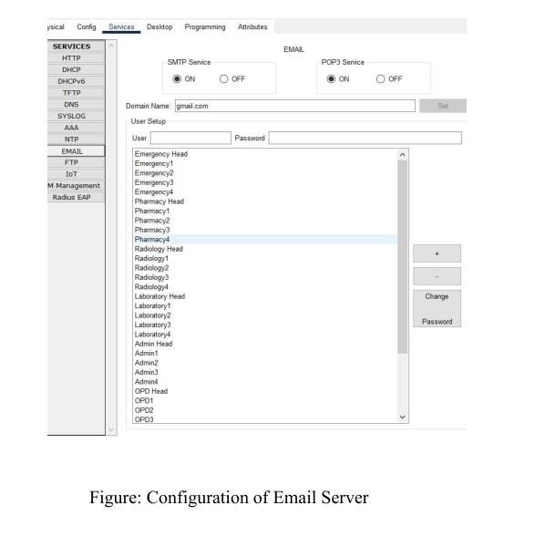

*Figure: Email Server (Services → EMAIL) — SMTP Service: `ON`, POP3 Service: `ON`, Domain Name: `gmail.com`. The User Setup list contains all hospital staff accounts: Emergency Head, Emergency1–4, Pharmacy Head, Pharmacy1–4, Radiology Head, Radiology1–4, Laboratory Head, Laboratory1–4, Admin Head, Admin1–4, OPD Head, OPD1–3 (list scrolls further down).*

---

**Screenshot 2 — DNS Server: A Record Mapping gmail.com to Email Server**

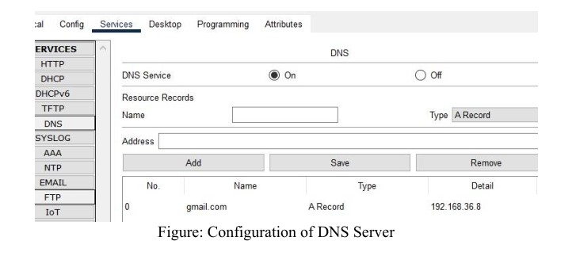

*Figure: DNS Server (Services → DNS) — DNS Service: `ON`. One Resource Record is configured: Name `gmail.com`, Type `A Record`, Detail `192.168.36.8`. This maps the domain name `gmail.com` to the internal Email server's IP address so all PCs can resolve the mail server by domain name.*

---

**Screenshot 3 — PC Email Client: Configure Mail for Emergency1**

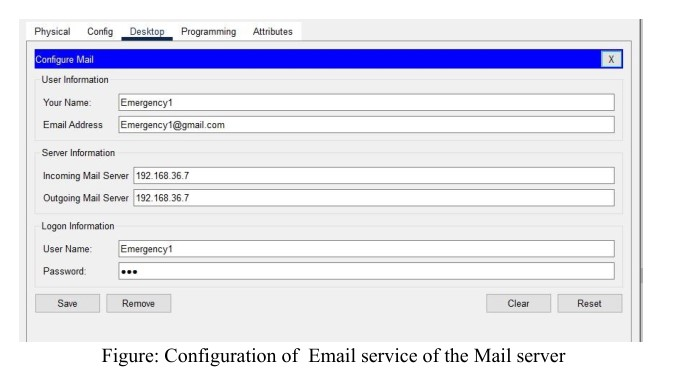

*Figure: PC `Emergency1` — Configure Mail dialog (Desktop → Email). Your Name: `Emergency1`, Email Address: `Emergency1@gmail.com`, Incoming Mail Server: `192.168.36.7`, Outgoing Mail Server: `192.168.36.7`, User Name: `Emergency1`, Password set. This points Emergency1's mail client to the centralized Email server.*

---

#### 2.2.4 Routing Configuration

**RIP Dynamic Routing — Router CLI:**

```
Router> enable
Router# configure terminal
Router(config)# router rip
Router(config-router)# network 192.168.30.0
Router(config-router)# network 192.168.31.0
Router(config-router)# network 192.168.32.0
Router(config-router)# network 192.168.33.0
Router(config-router)# network 192.168.34.0
Router(config-router)# network 192.168.35.0
Router(config-router)# network 192.168.36.0
Router(config-router)# exit
```

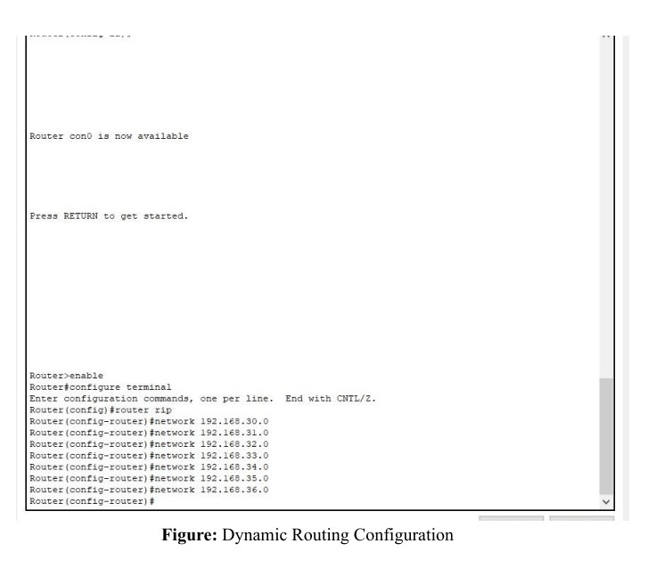

*Figure: RIP Dynamic Routing configuration via Router CLI — `router rip` mode is entered and all 7 department network addresses from `192.168.30.0` to `192.168.36.0` are advertised using `network` commands, allowing every router in the topology to learn routes to all subnets automatically.*

---

## 3. Results and Discussion

### 3.1 Network Connectivity

Comprehensive connectivity tests were conducted using the **ping command** from department PCs. Each PC successfully communicated with devices both within its own subnet and across different subnets, confirming correct IP assignments and fully functional RIP routing across all routers.

**Screenshot 1 — Ping Test: OPD (192.168.31.1) and Pharmacy (192.168.32.2)**

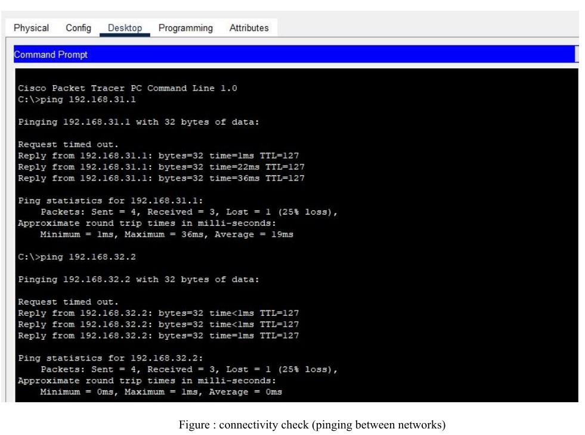

*Figure: Command Prompt on a source PC — `ping 192.168.31.1` (OPD Department): 3/4 packets received, 25% loss (first-packet ARP delay is normal), round-trip Min=1ms, Max=36ms, Avg=19ms. Then `ping 192.168.32.2` (Pharmacy Department): 3/4 packets received, Min=0ms, Max=1ms, Avg=0ms. Both cross-subnet pings confirm inter-departmental routing is working.*

---

**Screenshot 2 — Ping Test: Laboratory Department (192.168.34.2)**

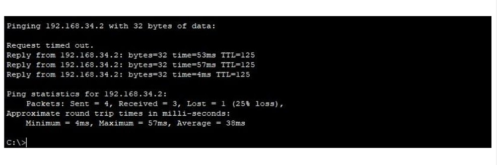

*Figure: Command Prompt — `ping 192.168.34.2` (Laboratory Department): 3/4 packets received, 25% first-packet loss (normal), round-trip Min=4ms, Max=57ms, Avg=38ms. The higher latency reflects multiple router hops to reach the Laboratory subnet, confirming end-to-end routing across the full network.*

---

### 3.2 FTP Access Testing

The FTP server at `192.168.36.6` was tested with multiple user profiles to verify that role-based permissions were correctly enforced.

**Screenshot 1 — FTP Upload (`put` command) as EmergencyHead**

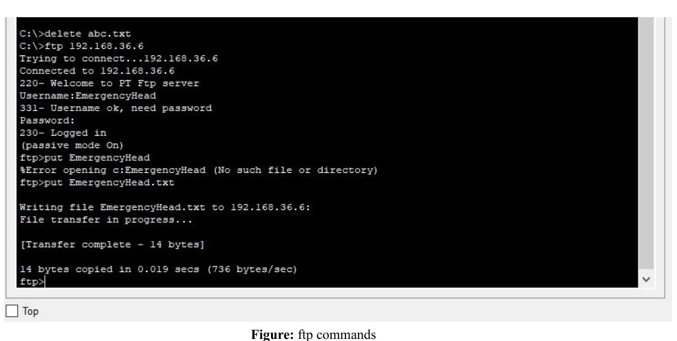

*Figure: FTP session on a PC — connects to `192.168.36.6`, logs in as `EmergencyHead` (password accepted, `230- Logged in`). The command `put EmergencyHead.txt` uploads the file to the server. Transfer completes: `[Transfer complete – 14 bytes]`, 14 bytes copied in 0.019 secs at 736 bytes/sec. This confirms Write permission works for AdminHead-level users.*

---

**Screenshot 2 — FTP Download (`get` command) as EmergencyHead**

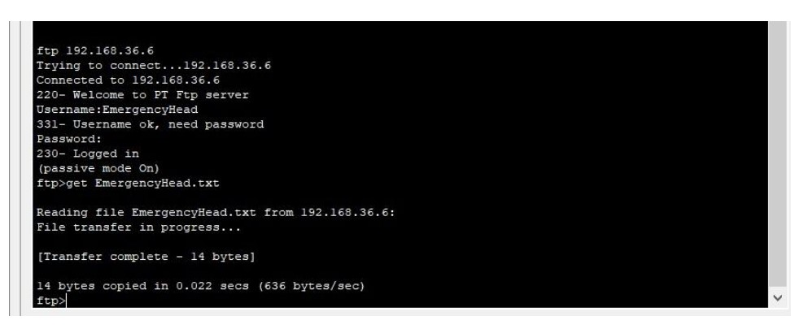

*Figure: FTP session — logged in as `EmergencyHead` to `192.168.36.6`. The command `get EmergencyHead.txt` downloads the previously uploaded file. Transfer completes: `[Transfer complete – 14 bytes]`, 14 bytes in 0.022 secs at 636 bytes/sec. This confirms Read permission is also functional.*

---

**Screenshot 3 — FTP Rename (`rename` command)**

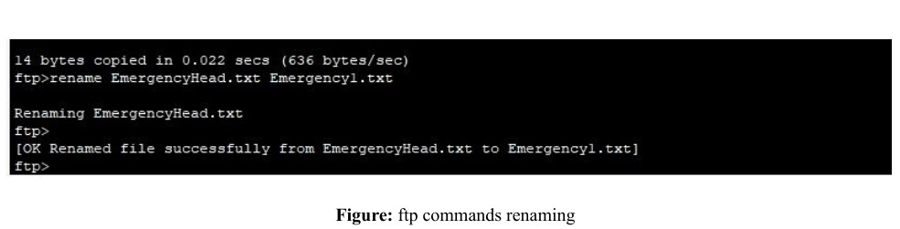

*Figure: FTP session — command `rename EmergencyHead.txt Emergency1.txt` renames the file on the server. Server responds: `[OK Renamed file successfully from EmergencyHead.txt to Emergency1.txt]`. This confirms Rename permission is granted to the `EmergencyHead` / AdminHead-level role.*

---

**Screenshot 4 — FTP Directory Listing (`dir` command)**

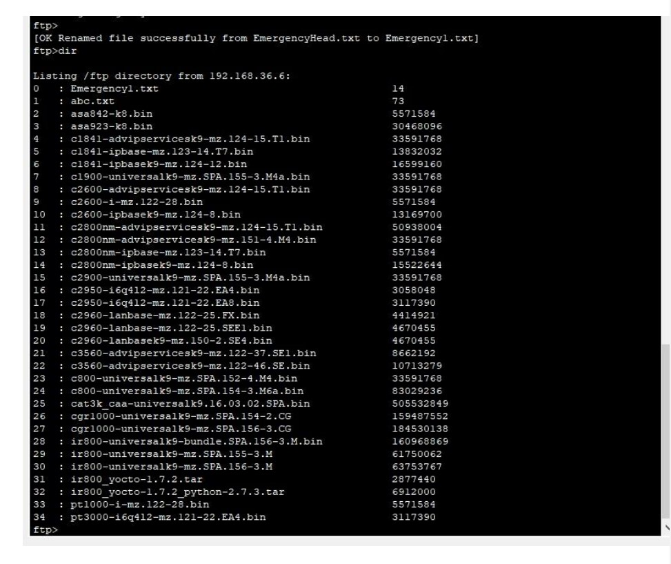

*Figure: FTP `dir` command output — lists all 35 files in the `/ftp` directory on `192.168.36.6`. The renamed file `Emergency1.txt` (14 bytes) appears at index 0, followed by `abc.txt` (73 bytes) at index 1. The remaining entries are default Cisco IOS image `.bin` and `.tar` files pre-loaded in Packet Tracer's FTP server. This confirms the directory listing (List) permission works correctly.*

---

**Screenshot 5 — FTP Delete (`delete` command)**

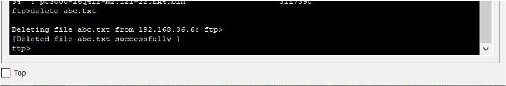

*Figure: FTP session — command `delete abc.txt` removes the file from the server at `192.168.36.6`. Server confirms: `[Deleted file abc.txt successfully]`. This confirms Delete permission is correctly granted to the `AdminHead` / privileged role, completing the full RWDNL access verification.*

---

### 3.3 Email Communication

Each PC was configured with an email client pointed to the centralized email server at `192.168.36.7`. Emails were composed and sent across departments and successfully received, confirming that SMTP and POP3 services were operating correctly end-to-end.

**Screenshot 1 — Composing and Sending an Email**

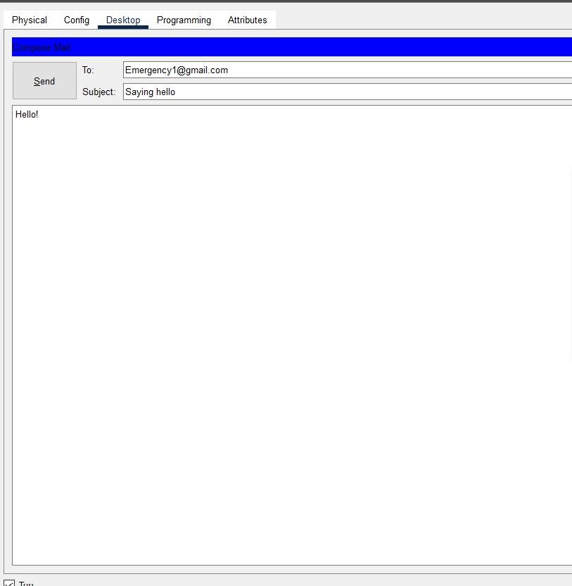

*Figure: Compose Mail window on a department PC (Desktop → Email → Compose) — To: `Emergency1@gmail.com`, Subject: `Saying hello`, Body: `Hello!`. Clicking `Send` dispatches the email through the SMTP server at `192.168.36.7`.*

---

**Screenshot 2 — Receiving Email in Inbox**

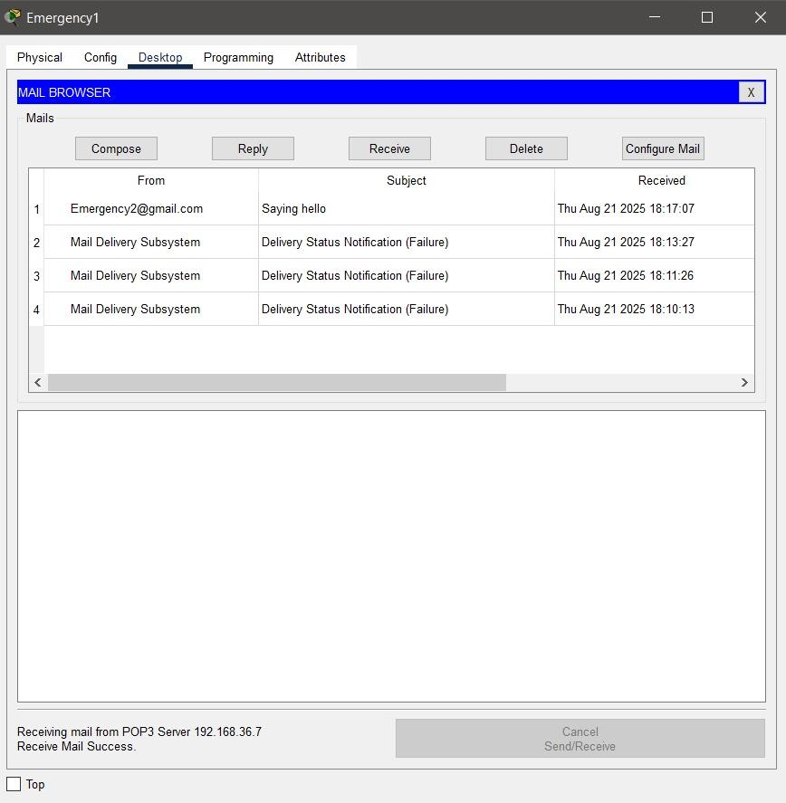  

*Figure: Mail Browser on PC `Emergency1` (Desktop → Email → Receive) — inbox shows 1 successfully received email from `Emergency2@gmail.com`, Subject: `Saying hello`, received Thu Aug 21 2025 at 18:17:07. Status bar at bottom confirms: `Receiving mail from POP3 Server 192.168.36.7` and `Receive Mail Success.` The 3 "Delivery Status Notification (Failure)" entries are from earlier misconfigured test attempts before DNS was properly set up.*

---

## 4. Conclusion

The Smart Hospital Network project successfully demonstrated a complete enterprise-level network infrastructure using Cisco Packet Tracer:

- Each department was isolated as a **separate LAN with its own /24 subnet**, enabling organized and secure traffic separation.
- All LANs were interconnected via **2811 Routers using RIP dynamic routing**, enabling seamless cross-departmental data exchange.
- **FTP role-based access control** was correctly enforced — `AdminHead` with full RWDNL permissions while all department users were restricted to Read-only.
- **Email communication** (SMTP + POP3) was fully functional across all departments via the centralized mail server at `192.168.36.7`.
- **DNS resolution** was configured to map `gmail.com` to the internal email server IP `192.168.36.8`.
- All **ping connectivity tests** confirmed successful routing across every subnet with expected latency.

The design provides a **scalable, secure, and educationally relevant** model for real-world hospital network deployment, providing hands-on experience in designing, configuring, and managing a complete enterprise-level network infrastructure.

---

## 🛠 Technologies & Protocols Used

| Technology / Protocol | Role in the Project |
|---|---|
| Cisco Packet Tracer | Network simulation environment |
| Cisco 2811 Router | Inter-departmental routing |
| Cisco 2950 / 2960 Switch | Intra-departmental LAN switching |
| RIP v1 (Dynamic Routing) | Automatic route advertisement between all 7 subnets |
| FTP (File Transfer Protocol) | Centralized file storage with role-based access control |
| SMTP / POP3 | Send and receive email between departments |
| DNS (Domain Name System) | Resolves `gmail.com` → `192.168.36.8` (Email server) |
| IPv4 /24 Subnetting | Structured per-department IP address management |
| Static IP Assignment | All PCs, servers, and router interfaces manually configured |

---

## 📁 Project Structure

```
smart_hospital_network/
│
├── README.md                   ← This file
│
└── images/
    ├── topology_overview.png   ← Full PKT topology screenshot (uploaded image)
    ├── img_01_page4.jpeg       ← Network topology diagram (from report)
    ├── img_02_page6.jpeg       ← Router1 CLI: IP address assignment
    ├── img_03_page7.jpeg       ← PC Desktop: Static IP configuration
    ├── img_04_page8.jpeg       ← FTP Server: AdminHead RWDNL + Admin1-4 R
    ├── img_05_page8.jpeg       ← FTP Server: Emergency1 Read-only
    ├── img_06_page8.jpeg       ← FTP Server: Emergency4 + Emergency2/3/4 list
    ├── img_07_page9.jpeg       ← Email Server: SMTP/POP3 ON + full user list
    ├── img_08_page10.jpeg      ← DNS Server: gmail.com A Record → 192.168.36.8
    ├── img_09_page10.jpeg      ← PC Configure Mail: Emergency1 setup
    ├── img_10_page11.jpeg      ← Router CLI: RIP routing all 7 networks
    ├── img_11_page12.jpeg      ← Ping test: 192.168.31.1 & 192.168.32.2
    ├── img_12_page13.jpeg      ← Ping test: 192.168.34.2 (Laboratory)
    ├── img_13_page14.jpeg      ← FTP: put EmergencyHead.txt (upload)
    ├── img_14_page14.jpeg      ← FTP: get EmergencyHead.txt (download)
    ├── img_15_page15.jpeg      ← FTP: rename EmergencyHead.txt → Emergency1.txt
    ├── img_16_page15.jpeg      ← FTP: dir listing (35 files on server)
    ├── img_17_page16.jpeg      ← FTP: delete abc.txt successfully
    ├── img_18_page18.jpeg      ← Compose Mail: To Emergency1, Subject Saying hello
    └── img_19_page19.jpeg      ← Mail Browser: Emergency1 inbox, Receive Mail Success
```
